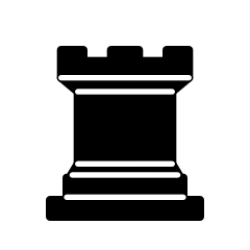

# Chess

By Alejandro Campo

  
    Press Space for next page <carbon:arrow-right class="inline"/>
  

<!--
The last comment block of each slide will be treated as slide notes. It will be visible and editable in Presenter Mode along with the slide. [Read more in the docs](https://sli.dev/guide/syntax.html#notes)
-->

---
transition: slide-left
layout: image-right
image: https://source.unsplash.com/collection/73658153/1920x1080
---

# What is Chess?
Chess is one of the oldest board games in the world. It's played between two players, simulating a war between two kingdoms. It's turn based and completely deterministic with no hidden information, meaning that the element of luck is almost non-existent.

---
transition: slide-left
---

# Rules of chess

  

    Although there are some complex rules that take part in chess, you only require five to get started.
  
  - How to setup the chessboard.
  - How the pieces move.
  - Some special rules: castling, draw positions...
  - White plays first.
  - When a position is considered a win, a.k.a checkmate.
  
  

  

    
    
How to setup the board

  

---
layout: two-cols
---

::right::

  

---
layout: two-cols
---

::right::

  

---
layout: two-cols
---

::right::

  

---
layout: two-cols
---

::right::

  

---
layout: two-cols
---

::right::

  

---
layout: two-cols
---

::right::

  

---
transition: slide-left
layout: iframe-right
url: https://www.chess.com/emboard?id=10690559
---

# Where can I play chess?

  There are many places where you can play chess! Mainly, you could decide to play physically, perhaps in the park or by joining a club. Albeit you may very well prefer to spare yourself from all the hussle and play online.
  
  If the latter is your desired choice, I recommend checking out [chess.com](https://chess.com). It has a great UI and features, most Grand Masters play there.

  It can also let you review your past games. This is a game extracted from their archive played by the former World Champ, Magnus Carlsen, and GM Hikaru Nakamura.

---
transition: slide-left
---
# Parts of a chess game
 - **Opening**: Ah, the opening! Just like a blank canvas ready to be painted by masterful brushstrokes, this is when you decide the strategy to seize control of the board. Even though there is a lot of theory surrounding openings, the main idea is getting your pieces in active places, where they will be useful on your search for domination of the center. As you may have guessed, the center plays a major role in how a game will flesh out.
 - **Middlegame**: Once you have survived the opening, the middlegame starts. Here, you will have to find weakspots in the enemies position, or perhaps making them yourself...
 - **Endgame**: When the dust from the middlegame settles, it's time for the endgame. Players aim to convert their advantage into a victorious end. As endgames don't have as many variables, there're emerging patterns that are worth studying, such as fortresses and ladder mates.

---
transition: slide-left
layout: two-cols
---
# What're ELO points?

  Most online games implement a "ladder" competitive system in which players are ranked by their total score. This is nothing new in the chess world, as we have what are called ELO points. ELO is the way to measure the average rank of a player. It is dependant of course, on the win ratio, but also on other factors, as the strength of your oponent.
  Making your ELO grow is a testament to ones dedication to studying the game, but in the professional scene there are real races to be placed at the top. The rank system that FIDE defines depending on the ELO is as follows:

  

  - Below 1000: Novices
  - Class E: 1000-1200
  - Class D: 1200-1400
  - Class C: 1400-1600
  - Class B: 1600-1800
  - Class A: 1800-2000
  - **Candidate Masters (CM)**: 2000-2200
  - **National Masters (NM)**: 2200-2300
  - **International Masters (IM)**: 2300-2400
  - **Grandmasters (GM)**: 2500-2700
  

::right::

---
transition: slide-left
layout: section
---

<h1 class="font-extrabold text-transparent text-8xl bg-clip-text bg-gradient-to-r from-purple-400 to-pink-600">Now try it  yourself 🤔</h1>

---
transition: slide-left
#layout: iframe
# url: https://fritz.chessbase.com
---

  <Chessboard></Chessboard>
  
  _Note: you may require to reset the board if it is unresponsive_

